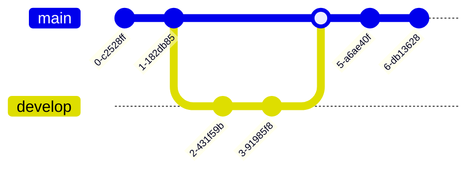

Langage: BASH

---
Bash: langage
category: Débutant
---


# Exemple de Mermaid en français

-- Mermaid pour Github




```mermaid
flowchart TD
	id1(Sujet en attente) --> id2(Boite de réception)
	id2 --> id3[Catégoriser]
	id3 --> id4{Action nécessaire?}
	id4 -- Non --> Jeter & Futur & Conserver
	id4 -- Oui --> id5{Plusieurs étapes?}
	id5 --> id7[Classer le projet]
	id7 --> id8[Découper] --> id9[Déterminer la première action]
	id9 --> id10{> 2 minutes?}

	id5 -- Non --> id10

	id10 --> id11[Faire tout de suite]
	id10 --> id12{Délégué?}

	id12 -- Oui --> id13[Effecturer la délégation]
	id12 -- Non --> id14[Reporter]
  ```
```mermaid
flowchart LR
	classDef rouge fill: #F00
A(Toutes mon Activités) --> B(tâches)
B --> Projets & C(Tâches complexes) & D(Tâches unitaires)
B --> E(Tâches au long court):::rouge
B --> F(Livrables)

A --> G(Rendez-vous)
G -. Sujets .-> B
G -. Actions .-> B
```

